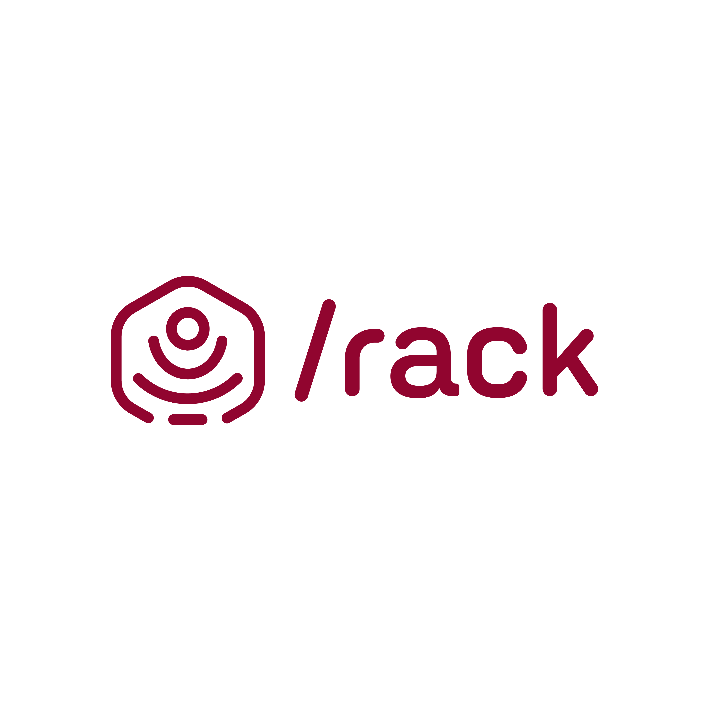
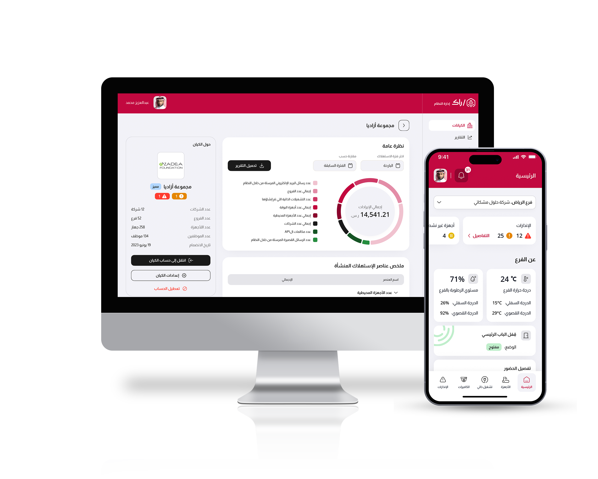

import imageChelseaHagon from '@/images/team/chelsea-hagon.jpg'

export const article = {
  date: '2023-04-06',
  title: 'Rack',
  description:
    'Rack Smart Retail System is one of the comprehensive solutions fot managing retail operations and data analysis to increase efficiency and improve sales.',
  author: {
    name: 'Chelsea Hagon',
    role: 'Senior Developer',
    image: { src: imageChelseaHagon },
  },
}

export const metadata = {
  title: article.title,
  description: article.description,
}

 
 
 
 

## Rack

Rack Smart Retail System is one of the comprehensive solutions for managing
retail operations and data analysis to increase efficiency and improve sales.

Introducing Rack, the ultimate solution for overseeing and monitoring your business operations through automation.
With Rack, you can take control of your business like never before, with a range of powerful features designed to streamline processes and provide
valuable insights into your operations, sales, and customer behavior.

Rack offers real-time monitoring capabilities, allowing you to stay updated on your business operations at all times.
With instant access to vital information, you can make informed decisions and take proactive actions to drive business growth.
Gain valuable insights into sales trends, customer behavior, and operational efficiency, empowering you to optimize your strategies for maximum success.
Say goodbye to manual tasks and streamline your operations with Rack's automation capabilities. From inventory management to order fulfillment and beyond,
Rack automates key processes, reducing human error and saving you valuable time and resources. Embrace efficiency and let Rack handle the repetitive tasks while you focus on growing your business.

