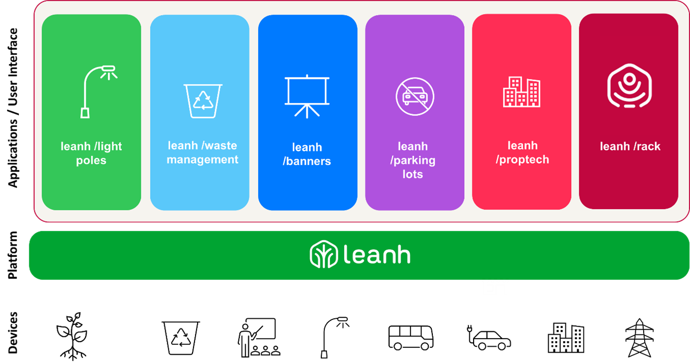

import imageLeslieAlexander from '@/images/team/leslie-alexander.jpg'

export const article = {
  date: '2024-02-18',
  title: 'Leanh',
  description:
    'A leading platform for developing smart city and Internet of Things solutions using Artificial intelligence for forecasting, decision making and bringing together solutions under one umbrella.',
  author: {
    name: 'Leslie Alexander',
    role: 'Co-Founder / CEO',
    image: { src: imageLeslieAlexander },
  },
}

export const metadata = {
  title: article.title,
  description: article.description,
}

 
 
 
 

## Leanh

A leading platform for developing smart city and Internet of Things solutions

using Artificial intelligence for forecasting, decision making and bringing together solutions under one umbrella.

With Leanh, cities can harness the power of advanced technologies data analytics, and IoT to optimize

urban infrastructure enhance public services, and improve the overall quality of life for residents.

With Leanh, cities can harness the power of advanced technologies, data analytics, and IoT to optimize urban infrastructure, enhance public services, and improve the overall quality of life for residents.
With Leanh, cities can unlock their full potential and become vibrant, sustainable, and inclusive smart cities. By embracing the power of technology and citizen engagement, Leanh paves the way for more efficient and responsive urban environments. Join the movement toward smarter cities with Leanh and redefine the future of urban living.
