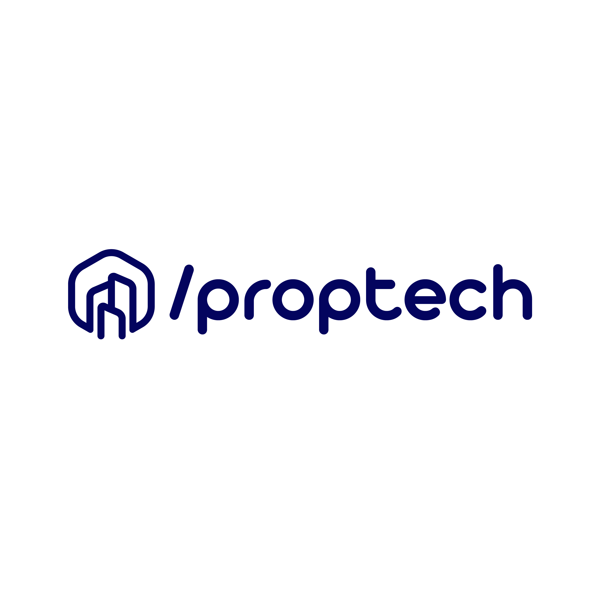

import imageAngelaFisher from '@/images/team/angela-fisher.jpg'

export const article = {
  date: '2023-01-01',
  title: 'Proptech',
  description:
    'Introducing /proptech, the revolutionary smart solution for property management that empowers property owners and managers to streamline operations, enhance tenant experiences, and maximize returns on their real estate investments.',
  author: {
    name: 'Angela Fisher',
    role: 'Front-end Developer',
    image: { src: imageAngelaFisher },
  },
}

export const metadata = {
  title: article.title,
  description: article.description,
}

 
 
 
 

## Proptech

Introducing /proptech, the revolutionary smart solution for property management that empowers property owners and managers to streamline operations,
enhance tenant experiences, and maximize returns on their real estate investments.
Proptech leverages cutting-edge technology and innovative features to transform traditional property management into a seamless, efficient, and data-driven process.

By embracing Proptech, property owners and managers can revolutionize their operations, improve tenant satisfaction, and optimize financial performance.
Experience the power of technology-driven property management with Proptech and unlock new levels of efficiency, profitability, and tenant engagement.
Simplify your property management journey with Proptech and take control of your real estate investments like never before.
