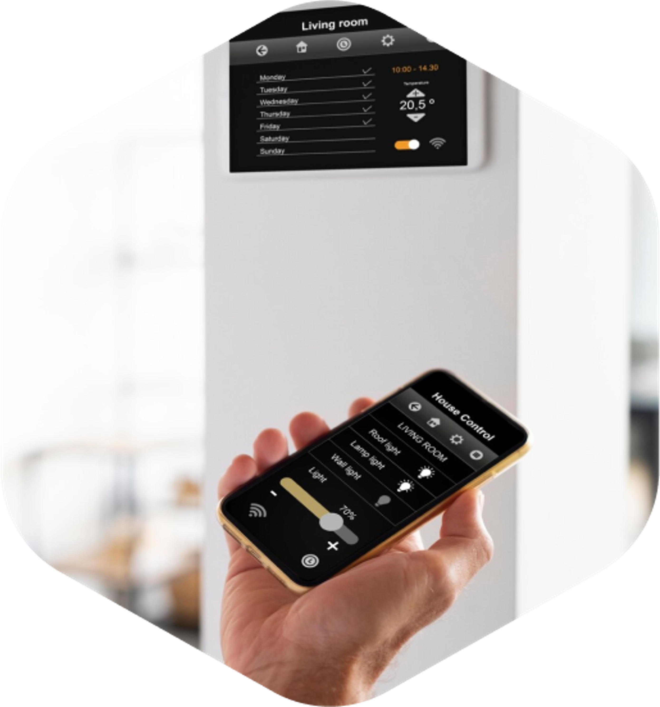

import logo from './businesses.svg'
import imageHero from './useCase.jpg'
import imageDebraFiscal from './debra-fiscal.jpg'

export const caseStudy = {
  client: 'FamilyFund',
  title:
    'Following are some of the use cases and scenarios ready for implementation',
  description: '',
  summary: [
    'ensures compliance with health and safety standards using heatmap cameras and facial recognition technology to create heat maps of crowd distribution, enhancing security and safety monitoring.',
  ],
  logo,
  image: { src: imageHero },
  date: '2023-01',
  service: 'Web development, CMS',
  testimonial: {
    author: { name: 'Debra Fiscal', role: 'CEO of FamilyFund' },
    content:
      'Working with Studio, we felt more like a partner than a customer. They really resonated with our mission to change the way people convince their parents to cash out their pensions.',
  },
}

export const metadata = {
  title: `${caseStudy.client} Case Study`,
  description: caseStudy.description,
}

## Overview

ensures compliance with health and safety standards using heatmap cameras and facial recognition technology

## Crowd management

track the movement of a crowd in buildings. And identify the number and gender of people who enter and exit the premises.

## Emotion detection

identify what a person’s feeling right now based on his emotion. to help our customers identify if their visitors are satisfied with the service they get.

## Face recognition

This use case is being used in access control and employee attendance.

## Heatmap discovery

Discover the main point at the retail store that has the highest visited area.

## Person and employee tracking

Track the real time employees’ movements. This would help evaluating the behavior of store salesmen as an example.

## Smart Parking

Optimize space utilization and reduce congestion while offering real-time availability updates and automated vehicle entry/exit.

## Smart Smart Access Control

A full control on granting the necessary access authority is at your hands. Car plats, persons’ faces, and employees’ IDs can be recognized.

## Smart buildings

Residents will have the ability to control and monitor the devices in their apartment using a mobile application.

## Alert detection

Discover the dangerous situations at retail stores or properties, and Preventative actions can be easily automated.

## Smart cities

Improve the lives of residents and facilitate access to public services. It connects all parts of the city with each other.

